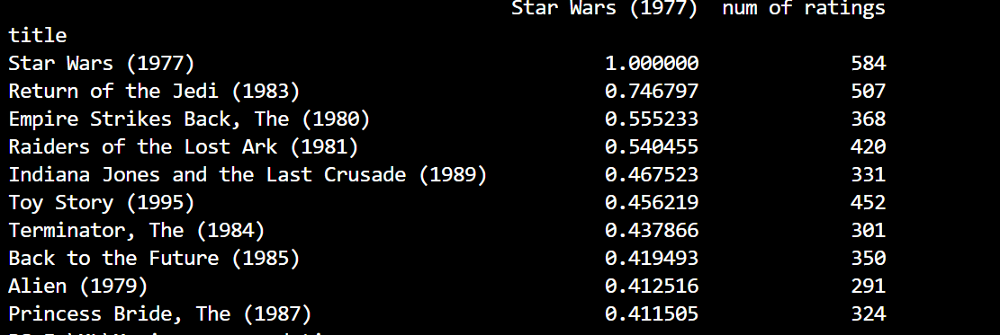
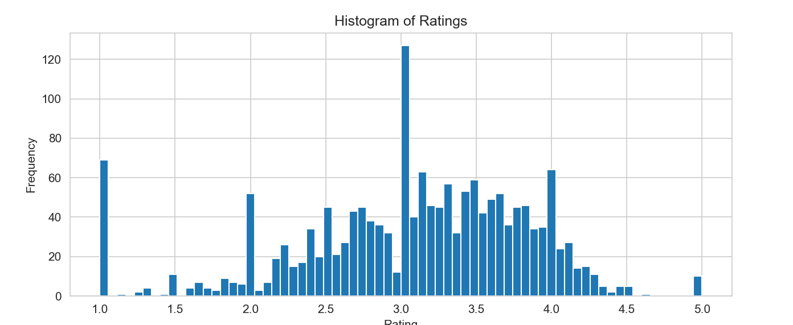
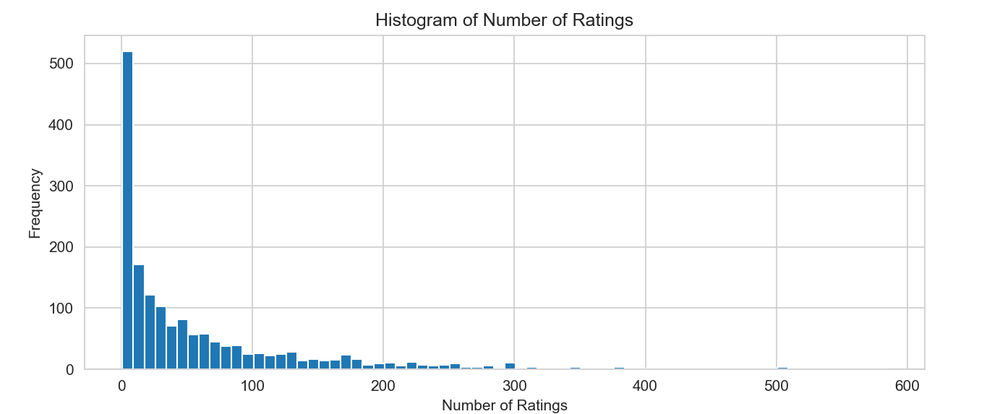

# Movie Recommendation System

This project demonstrates a simple movie recommendation system using collaborative filtering techniques with Python and Pandas.

## Overview

The movie recommendation system is built using a dataset containing movie ratings from users. It uses Pandas for data manipulation, NumPy for numerical computations, and Matplotlib and Seaborn for data visualization.




## Requirements
- pandas
- numpy
- matplotlib
- seaborn

## Usage
1. **Clone the repository:**
   ```sh
   git clone https://github.com/mohammadhashim135/movie-recommendation.git
   cd home-price-prediction
2. **Install required libraries:**
   ```bash
    pip install pandas numpy matplotlib seaborn
  
3. **Run the Script:**
   ```sh
    python movie_recommendation.py

## Credits

## Author

[](https://youtube.com/@ByteMazeHashim?si=5vcrIglNQO8i9Ram)
- Mohammad Hashim
- Email: hashimmohammad1375@gmail.com
- LinkedIn: [Mohammad Hashim](https://www.linkedin.com/in/mohammad-hashim-07ab362a6)
- YouTube: [ByteMazeHashim](https://youtube.com/@ByteMazeHashim?si=5vcrIglNQO8i9Ram)


## License

This project is licensed under the MIT License. See the [LICENSE](LICENSE) file for details.


